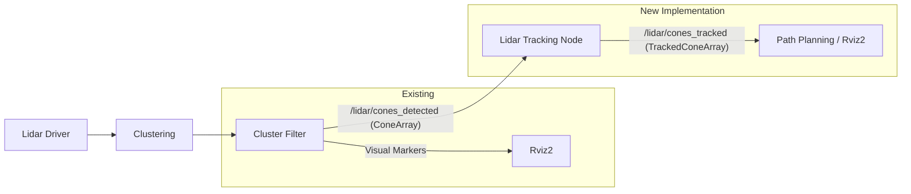

# L-ByteTrack Implementation Plan for Cone Tracking

## 1. 개요 (Overview)
*   **목표**: `cluster_filter`에서 검출된 Cone 클러스터에 ID를 부여하고, 시간 흐름에 따른 위치를 추정(Tracking)하여 경로 계획(Planning)에 안정적인 데이터를 제공합니다.
*   **핵심 알고리즘**: L-ByteTrack (LiDAR-based ByteTrack)
    *   **Kalman Filter**: 객체의 위치 및 속도 추정 (Constant Velocity Model).
    *   **ByteTrack Association**: High Confidence와 Low Confidence 검출 결과를 단계적으로 매칭하여 추적 성능 향상.

## 2. 시스템 아키텍처 (System Architecture)

### 2.1. 데이터 흐름 (Data Flow)


### 2.2. 패키지 구조 변경
*   **`src/lidar/lidar_interfaces` (신규)**: 커스텀 메시지 정의.
*   **`src/lidar/cluster_filter` (수정)**: 기존 Marker 외에 `ConeArray` 메시지 발행 기능 추가.
*   **`src/lidar/lidar_tracking` (신규)**: L-ByteTrack 알고리즘이 탑재된 노드.

---

## 3. 상세 구현 내용 (Detailed Implementation)

### Phase 1: 인터페이스 정의 (`lidar_interfaces`)
트래킹을 위해 구조화된 데이터 메시지가 필요합니다.

*   **`Cone.msg`**: 단일 Cone 객체 정보
    ```
    std_msgs/Header header
    geometry_msgs/Point position      # 중심 좌표 (x, y, z)
    geometry_msgs/Vector3 dimensions  # 크기 (width, depth, height)
    float32 confidence                # 신뢰도 (0.0 ~ 1.0) -> ByteTrack 핵심
    int32 label                       # 클러스터 라벨 (디버깅용)
    ```
*   **`ConeArray.msg`**: 한 프레임의 Cone 목록
    ```
    std_msgs/Header header
    Cone[] cones
    ```
*   **`TrackedCone.msg`**: 추적된 정보 (ID 포함)
    ```
    std_msgs/Header header
    uint32 track_id                   # 고유 ID
    geometry_msgs/Point position      # 보정된 위치 (Kalman Filtered)
    geometry_msgs/Vector3 velocity    # 속도 (vx, vy, vz)
    float32 confidence
    ```
*   **`TrackedConeArray.msg`**: 전체 트랙 목록

### Phase 2: 데이터 파이프라인 연결 (`cluster_filter`)
기존 `filter_component.cpp`는 시각화용 `MarkerArray`만 보냅니다. 이를 수정하여 raw 데이터를 보냅니다.

*   **수정 사항**:
    1.  `lidar_interfaces` 패키지 의존성 추가.
    2.  `cone_data_pub_` 퍼블리셔 추가 (`/lidar/cones_detected`).
    3.  필터링 로직 통과 후, `Marker` 생성 시점에 `Cone` 메시지도 함께 채워서 Publish.
    4.  **Confidence 설정**: 현재 별도의 분류기(Classifier)가 없다면, 기하학적 특징(원통형 유사도, 밀도 등)을 기반으로 0.5~1.0 사이의 값을 할당합니다. (예: `confidence = 1.0` 고정 후 추후 고도화)

### Phase 3: 트래킹 노드 구현 (`lidar_tracking`)
가장 핵심적인 부분으로, C++ 클래스 형태로 구현합니다.

#### 3.1. Kalman Filter (`KalmanFilter.hpp`)
*   **State**: `[x, y, vx, vy]` (지면 위 Cone이므로 2D 등속 모델 적용 권장. z는 관측값 그대로 사용).
*   **Predict**: 이전 상태를 기반으로 현재 위치 예측.
*   **Update**: 매칭된 관측값으로 상태 보정.

#### 3.2. ByteTrack 로직 (`ByteTracker.cpp`)
*   **입력**: `ConeArray` (Detection 목록)
*   **알고리즘 순서**:
    1.  **Prediction**: 모든 활성 트랙의 위치 예측.
    2.  **Detection 분리**:
        *   `D_high`: Confidence > `high_thresh` (확실한 물체)
        *   `D_low`: `low_thresh` < Confidence <= `high_thresh` (노이즈 가능성)
    3.  **1차 매칭 (High Score)**:
        *   `Tracks` vs `D_high`
        *   **Metric**: Euclidean Distance (Cone은 작으므로 IoU보다 거리 기반이 효과적).
        *   Hungarian Algorithm으로 최적 매칭 쌍 도출.
    4.  **2차 매칭 (Low Score)**:
        *   `Unmatched Tracks` vs `D_low`
        *   목적: 가려지거나 포인트가 튀어서 신뢰도가 낮아진 기존 트랙을 살림.
    5.  **Track 관리**:
        *   `New Track`: 매칭 안 된 `D_high`에서 생성.
        *   `Lost`: 매칭 실패한 트랙. 일정 프레임 이상 Lost 상태면 삭제.

### Phase 4: 시각화 및 검증
*   `lidar_tracking` 노드에서 `/lidar/cones_tracked` 토픽 발행.
*   Rviz2에서 해당 토픽을 Subscribe하여 ID가 유지되는지 확인 (ID별로 색상을 다르게 하거나 Text 마커 표시).

---

## 4. 진행 순서 (Action Plan)

1.  **[Interface]**: `lidar_interfaces` 패키지 생성 및 빌드.
2.  **[Upstream]**: `cluster_filter` 수정하여 `ConeArray` 토픽 발행 확인.
3.  **[Tracking Core]**: `lidar_tracking` 패키지 생성 (Kalman Filter, Hungarian Algo 기본 코드 작성).
4.  **[Integration]**: ByteTrack 로직 통합 및 디버깅.
